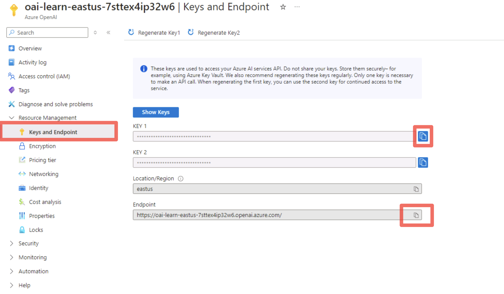

@lab.Title

Login to your VM with the following credentials...

**Username: ++@lab.VirtualMachine(Win11-Pro-Base-VM).Username++**

**Password: +++@lab.VirtualMachine(Win11-Pro-Base-VM).Password+++**

# Table of Contents

1. [Part 0 - Log into Azure](#part-0---log-into-azure)
1. [Part 1 - Getting started with AI on Azure PostgreSQL flexible server](#part-1---getting-started-with-ai-on-azure-postgresql-flexible-server)
    1. [Clone TechConnect Lab repo](#clone-techconnect-lab-repo)
    1. [Connect to your database using psql in the Azure Cloud Shell](#connect-to-your-database-using-psql-in-the-azure-cloud-shell)
    1. [Populate the database with sample data](#populate-the-database-with-sample-data)
    1. [Setting up pgAdmin](#setting-up-pgadmin)
    1. [Install and configure the `azure_ai` extension](#install-and-configure-the-azure_ai-extension)
1. [Part 2 - Using AI-driven features in Postgres](#part-2---using-ai-driven-features-in-postgres)
    1. [Using Pattern matching for queries](#using-pattern-matching-for-queries)
    1. [Using Semantic Search and DiskANN](#using-semantic-search-and-diskann-index)
1. [ Part 3 - How RAG chatbot accuracy improves with different technique](#part-3---how-rag-chatbot-accuracy-improves-with-different-technique)
    1. [Exploring Cases RAG application](#exploring-cases-rag-application)
    1. [Review Accuracy of vector search queries](#review-accuracy-of-vector-search-queries)
1. [Part 4 - Improving RAG Accuracy with Advanced Techniques - Reranking and GraphRAG](#part-4---improving-rag-accuracy-with-advanced-techniques---reranking-and-graphrag)
    1. [Reranker](#what-is-a-reranker)
    1. [GraphRAG](#what-is-graphrag)
    1. [Compare Results of RAG responses using Vector search, Reranker or GraphRAG](#compare-results-of-rag-responses-using-vector-search-reranker-or-graphrag)

# Part 0 - Log into Azure
Login to Azure Portal with the following credentials.

1. Go to [Azure portal](https://portal.azure.com/) `https://portal.azure.com/`
    - Username: +++@lab.CloudPortalCredential(User1).Username+++
    - Password:+++@lab.CloudPortalCredential(User1).Password+++

===
# Part 1 - Getting started with AI on Azure PostgreSQL flexible server

## Clone TechConnect Lab repo

1. Open a web browser and navigate to the [Azure portal](https://portal.azure.com/).

2. Select the **Cloud Shell** icon in the Azure portal toolbar to open a new [Cloud Shell](https://learn.microsoft.com/azure/cloud-shell/overview) pane at the bottom of your browser window.

    

    If prompted, select the required options to open a *Bash* shell. If you have previously used a *PowerShell* console, switch it to a *Bash* shell. 
    

    Also pick *No storage account required* and select your subscription.
    

3. At the Cloud Shell prompt, enter the following to clone the GitHub repo containing exercise resources:

    > +++git clone https://github.com/Azure-Samples/mslearn-pg-ai.git+++


## Connect to your database using psql in the Azure Cloud Shell

In this task, you connect to the <code spellcheck="false">cases</code> database on your Azure Database for PostgreSQL flexible server using the [psql command-line utility](https://www.postgresql.org/docs/current/app-psql.html) from the [Azure Cloud Shell](https://learn.microsoft.com/azure/cloud-shell/overview).

1. In the [Azure portal](https://portal.azure.com/), navigate to **Resource Groups** and select the resource group with the name **ResourceGroup1**
    
    
2. In that resource group select the precreated **Azure Database for PostgreSQL flexible server** instance.
    
3. In the resource menu, under **Settings**, select **Databases** select **Connect** for the <code spellcheck="false">cases</code> database.
<br>
    

>[!hint]  This step will ask you to launch the new cloud shell instance, this is fine, you will not lose the previously cloned content.

4. At the "Password for user pgAdmin" prompt in the Cloud Shell, enter the password for the **pgAdmin** login.
    > [!alert]
    **MAKE SURE YOU TYPE IN YOUR PASSWORD, COPY & PASTE MAY NOT WORK**

    **Password:** +++passw0rd+++

    Once logged in, the <code spellcheck="false">psql</code> prompt for the <code spellcheck="false">cases</code> database is displayed.

5. Throughout the remainder of this exercise, you continue working in the Cloud Shell, so it may be helpful to expand the pane within your browser window by selecting the **Maximize** button at the top right of the pane.
<br>
    

## Populate the database with sample data

Before you explore the <code spellcheck="false">azure_ai</code> extension, add a couple of tables to the <code spellcheck="false">cases</code> database and populate them with sample data so you have information to work with as you review the extension's functionality.

1. Run the following commands to create the <code spellcheck="false">cases</code> tables for storing us cases law data :

    > +++\i mslearn-pg-ai/Setup/SQLScript/initialize_dataset.sql;+++

### Explore Database

1. When working with <code spellcheck="false">psql</code> in the Cloud Shell, enabling the extended display for query results may be helpful, as it improves the readability of output for subsequent commands. Execute the following command to allow the extended display to be automatically applied.
ata :

    > +++\x auto+++

1. First we will retrieve a sample of data from the cases table in our cases dataset. This allows us to examine the structure and content of the data stored in the database.
ata :

    > +++SELECT * FROM cases
    LIMIT 1;+++

===
## Setting up PGAdmin
Now you have explored the database in Azure and configured the Azure OpenAI endpoints. We are going to switch over to working in [pgAdmin](https://www.pgadmin.org/). pgAdmin is the most popular and feature-rich open-source administration and development platform for PostgreSQL, the most advanced open-source database in the world.

Using pgAdmin makes it easier to explore the output and understand how the AI features work in PostgreSQL. 

1. In a new tab, open the [Azure portal](https://portal.azure.com/), navigate to **Resource Groups** and select the resource group with the name **ResourceGroup1**
    

1. In that resource group select the precreated **Azure Database for PostgreSQL flexible server** instance.
    

1. In the resource menu of your Azure Database for PostgreSQL Flexible Server instance, under **Settings**, select **Connect** and follow instructions in Azure Portal on how to connect to pgAdmin.


    >[!tip] pgAdmin is already installed on your VM, you with find a *blue elephant icon* on your desktop.

    1. **Open pgAdmin 4:** Launch the pgAdmin 4 application on your computer. *This should be on your desktop.*

    1. **Register a new server:** In the pgAdmin 4 interface, *right-click* on "Servers" in the left-side browser tree, and select **"Register”** -> **“Server"**

    1. **Configure server details:** In the **"Register - Server"** window. Make sure:
        - **Hostname**: Find this in Azure Portal
        - **Maintenance database**: `cases`
        - **Username**: `pgAdmin`
        - **Password**: `passw0rd`
        - **Port**: `5432`

    1. **Save the configuration:** Click the "Save" button to save the server registration. pgAdmin 4 will now establish a connection to your Azure Database for PostgreSQL Flexible Server.

    1. **Access the database:** Once connected, you can expand the server in the browser tree to view databases, schemas, and tables. You can also interact with the server using the built-in query tool and manage your database objects.

1. Click the Query tool button on the top left to open the query tool and start working with queries in the upcoming sections.

    


## Install and configure the <code spellcheck="false">azure_ai</code> extension

>[!alert] Make sure you are using **pgAdmin** for the following steps.

Before using the <code spellcheck="false">azure_ai</code> extension, you must install it into your database and configure it to connect to your Azure AI Services resources. The <code spellcheck="false">azure_ai</code> extension allows you to integrate the Azure OpenAI and Azure AI Language services into your database. To enable the extension in your database, follow these steps:

1. Execute the following command in **pgAdmin** to verify that the <code spellcheck="false">azure_ai</code>, <code spellcheck="false">vector</code>, <code spellcheck="false">age</code> and <code spellcheck="false">pg_diskann</code> extensions were successfully added to your server's *allowlist* by the Bicep deployment script you ran when setting up your environment:

```sql
SHOW azure.extensions;
```

The command displays the list of extensions on the server's *allowlist*. If everything was correctly installed, your output must include <code spellcheck="false">azure_ai</code>, <code spellcheck="false">vector</code>, <code spellcheck="false">age</code> and <code spellcheck="false">pg_diskann</code> like this:

```sql-nocopy
 azure.extensions 
------------------
 azure_ai,vector,age,pg_diskann
```

Before an extension can be installed and used in an Azure Database for PostgreSQL flexible server database, it must be added to the server's *allowlist*, as described in [how to use PostgreSQL extensions](https://learn.microsoft.com/azure/postgresql/flexible-server/concepts-extensions#how-to-use-postgresql-extensions).


2. Now, you are ready to install the <code spellcheck="false">azure_ai</code> extension using the [CREATE EXTENSION](https://www.postgresql.org/docs/current/sql-createextension.html) command.

    ```sql
    CREATE EXTENSION IF NOT EXISTS azure_ai;
    ```

<code spellcheck="false">CREATE EXTENSION</code> loads a new extension into the database by running its script file. This script typically creates new SQL objects such as functions, data types, and schemas. An error is thrown if an extension of the same name already exists. Adding <code spellcheck="false">IF NOT EXISTS</code> allows the command to execute without throwing an error if it is already installed.

### Explore the Azure AI schema

The <code spellcheck="false">azure_ai</code> schema provides the framework for directly interacting with Azure AI and ML services from your database. It contains functions for setting up connections to those services and retrieving them from the <code spellcheck="false">settings</code> table, which is also hosted in the same schema. The <code spellcheck="false">settings</code> table provides secure storage in the database for endpoints and keys associated with your Azure AI and ML services.

1. Review the functions defined in the  <code spellcheck="false">azure_ai</code> schema. 
    - Review the schema in the [Microsoft documention](https://learn.microsoft.com/en-us/azure/postgresql/flexible-server/generative-ai-azure-overview#configure-the-azure_ai-extension)

         Schema |  Name  | Result data type | Argument data types | Type 
        ----------|-------------|------------------|----------------------|------
         azure_ai | get_setting | text      | key text      | func
         azure_ai | set_setting | void      | key text, value text | func
         azure_ai | version  | text      |           | func


> [!knowledge] Because the connection information for Azure AI services, including API keys, is stored in a configuration table in the database, the <code spellcheck="false">azure_ai</code> extension defines a role called <code spellcheck="false">azure_ai_settings_manager</code> to ensure this information is protected and accessible only to users who have been assigned that role. This role enables reading and writing of settings related to the extension. Only members of the <code spellcheck="false">azure_ai_settings_manager</code> role can invoke the <code spellcheck="false">azure_ai.get_setting()</code> and <code spellcheck="false">azure_ai.set_setting()</code> functions. In an Azure Database for PostgreSQL flexible server, all admin users (those with the <code spellcheck="false">azure_pg_admin</code> role assigned) are also assigned the <code spellcheck="false">azure_ai_settings_manager</code> role.
    
2. To demonstrate how you use the <code spellcheck="false">azure_ai.set_setting()</code> and <code spellcheck="false">azure_ai.get_setting()</code> functions, configure the connection to your Azure OpenAI account.
<br>

    a. Using the same browser tab where your Cloud Shell is open, minimize or restore the Cloud Shell pane, then navigate to your **<code spellcheck="false">Azure OpenAI</code>** resource in the [Azure portal](https://portal.azure.com/).
<br>

    b. Once you are on the Azure OpenAI resource page, in the resource menu, under the **Resource Management** section, select **Keys and Endpoint**, then copy your endpoint and one of the available keys.
<br>
    
<br>
    You can use either <code spellcheck="false">KEY 1</code> or <code spellcheck="false">KEY 2</code>. Always having two keys allows you to securely rotate and regenerate keys without causing service disruption.
3. Once you have your endpoint and key, maximize the *pgAdmin* window, then use the commands below to add your values to the configuration table. Ensure you replace the <code spellcheck="false">{endpoint}</code> and <code spellcheck="false">{api-key}</code> tokens with the values you copied from the Azure portal.

    ```sql
    SELECT azure_ai.set_setting('azure_openai.endpoint', '{endpoint}');
    SELECT azure_ai.set_setting('azure_openai.subscription_key', '{api-key}');
    ```

    When you add the key, the command should look like: 
    * *SELECT azure_ai.set_setting('azure_openai.endpoint', 'https://oai-learn-eastus-123456.openai.azure.com/');*
    * *SELECT azure_ai.set_setting('azure_openai.subscription_key', 'd33a123456781');*

4. You can verify the settings written into the <code spellcheck="false">azure_ai.settings</code> table using the <code spellcheck="false">azure_ai.get_setting()</code> function in the following queries:

    ```sql
    SELECT azure_ai.get_setting('azure_openai.endpoint');
    SELECT azure_ai.get_setting('azure_openai.subscription_key');
    ```

    the <code spellcheck="false">azure_ai</code> extension is now connected to your Azure OpenAI account.

### Review the Azure OpenAI schema

The <code spellcheck="false">azure_openai</code> schema provides the ability to integrate the creation of vector embedding of text values into your database using Azure OpenAI. Using this schema, you can [generate embeddings with Azure OpenAI](https://learn.microsoft.com/azure/ai-services/openai/how-to/embeddings) directly from the database to create vector representations of input text, which can then be used in vector similarity searches, as well as consumed by machine learning models. The schema contains a single function, <code spellcheck="false">create_embeddings()</code>, with two overloads. One overload accepts a single input string, and the other expects an array of input strings.

1. Review the details of the functions in the <code spellcheck="false">azure_openai</code> schema. 

    * Review in the [Microsoft documention](https://learn.microsoft.com/en-us/azure/postgresql/flexible-server/generative-ai-azure-openai#configure-openai-endpoint-and-key)

    The docs will shows the two overloads of the <code spellcheck="false">azure_openai.create_embeddings()</code> function, allowing you to review the differences between the two versions of the function and the types they return. 

2. To provide a simplified example of using the function, run the following query, which creates a vector embedding for the <code spellcheck="false">opinion</code> field in the <code spellcheck="false">cases</code> table. The <code spellcheck="false">deployment_name</code> parameter in the function is set to <code spellcheck="false">embedding</code>, which is the name of the deployment of the <code spellcheck="false">text-embedding-3-small</code> model in your Azure OpenAI service:

    ```sql
    SELECT
      id,
      name,
      azure_openai.create_embeddings('text-embedding-3-small', LEFT(opinion, 8000)) AS vector
    FROM cases
    LIMIT 1;
    ```

the output looks similar to this:


```sql-nocopy
 id |      name       |              vector
----+-------------------------------+------------------------------------------------------------
  507122 | Berschauer/Phillips Construction Co. v. Seattle School District No. 1 | {0.020068742,0.00022734122,0.0018286322,-0.0064167166,...}
```


for brevity, the vector embeddings are abbreviated in the above output.

[Embeddings](https://learn.microsoft.com/azure/postgresql/flexible-server/generative-ai-overview#embeddings) are a concept in machine learning and natural language processing (NLP) that involves representing objects such as words, documents, or entities, as [vectors](https://learn.microsoft.com/azure/postgresql/flexible-server/generative-ai-overview#vectors) in a multi-dimensional space. Embeddings allow machine learning models to evaluate how closely two pieces of information are related. This technique efficiently identifies relationships and similarities between data, allowing algorithms to identify patterns and make accurate predictions.

The <code spellcheck="false">azure_ai</code> extension allows you to generate embeddings for input text. To enable the generated vectors to be stored alongside the rest of your data in the database, you must install the <code spellcheck="false">vector</code> extension by following the guidance in the [enable vector support in your database](https://learn.microsoft.com/azure/postgresql/flexible-server/how-to-use-pgvector#enable-extension) documentation. However, that is outside of the scope of this exercise.

===
# Part 2 - Using AI-driven features in Postgres

In this section, we will explore how to leverage AI-driven features within PostgreSQL to enhance data processing and analysis. These features can help automate tasks, improve data insights, and provide advanced functionalities that traditional SQL queries may not offer.

>[!alert] Make sure you are using **pgAdmin** for the following steps.

## Using Pattern matching for queries

We will explore how to use the <code spellcheck="false">ILIKE</code> clause in SQL to perform case-insensitive searches within text fields. This is particularly useful when you want to find specific cases or reviews that contain certain keywords.

1. We will searching for cases mentioning `"Water leaking into the apartment from the floor above."`

    ```sql
    SELECT id, name, opinion
    FROM cases
    WHERE opinion ILIKE '%Water leaking into the apartment from the floor above';
    ```

    You'll get a result similar to this:

    ```sql-nocopy
    id | name | opinion
    ----+------+---------
    (0 rows)
    ```

However, it fall short as the exact words are not mentioned in the opinion. As you can see there are no results for what to user wants to find. We need to try another appoach.

## Using Semantic Search and DiskANN Index

In this section, we will focus on generating and storing embedding vectors, which are crucial for performing semantic searches in our dataset. Embedding vectors represent data points in a high-dimensional space, allowing for efficient similarity searches and advanced analytics.

### Create, store and index embedding vectors

Now that we have some sample data, it's time to generate and store the embedding vectors. The <code spellcheck="false">azure_ai</code> extension makes calling the Azure OpenAI embedding API easy.

1. Now, you are ready to install the <code spellcheck="false">vector</code> extension using the [CREATE EXTENSION](https://www.postgresql.org/docs/current/sql-createextension.html) command.

    ```sql
    CREATE EXTENSION IF NOT EXISTS vector;
    ```
1. Add the embedding vector column.
<br>
    The <code spellcheck="false">text-embedding-3-small</code> model is configured to return 1,536 dimensions, so use that for the vector column size.

    ```sql
    ALTER TABLE cases ADD COLUMN opinions_vector vector(1536);
    ```
1. Generate an embedding vector for the opinion of each case by calling Azure OpenAI through the create_embeddings user-defined function, which is implemented by the azure_ai extension:

    ```sql
    UPDATE cases
    SET opinions_vector = azure_openai.create_embeddings('text-embedding-3-small',  name || LEFT(opinion, 8000), max_attempts => 5, retry_delay_ms => 500)::vector
    WHERE opinions_vector IS NULL;
    ```

    >[!alert] This may take several minutes, depending on the available quota.

1. Adding an [DiskANN Vector Index](https://aka.ms/pg-diskann-docs) to improve vector search speed. 

    Using [DiskANN Vector Index in Azure Database for PostgreSQL](https://aka.ms/pg-diskann-blog) - DiskANN is a scalable approximate nearest neighbor search algorithm for efficient vector search at any scale. It offers high recall, high queries per second (QPS), and low query latency, even for billion-point datasets. This makes it a powerful tool for handling large volumes of data. [Learn more about DiskANN from Microsoft](https://aka.ms/pg-diskann-docs). Now, you are ready to install the <code spellcheck="false">pg_diskann</code> extension using the [CREATE EXTENSION](https://www.postgresql.org/docs/current/sql-createextension.html) command.

    ```sql
    CREATE EXTENSION IF NOT EXISTS pg_diskann;
    ```
1. Create the diskann index on a table column that contains vector data.

    ```sql
    CREATE INDEX cases_cosine_diskann ON cases USING diskann(opinions_vector vector_cosine_ops);
    ```
    as you scale your data to millions of rows, DiskANN makes vector search more effcient.

1. See an example vector by running this query:

    ```sql
    SELECT opinions_vector FROM cases LIMIT 1;
    ```

    you will get a result similar to this, but with 1536 vector columns. The output will take up alot of your screen, just hit enter to move down the page to see all of the output:

    ```sql-nocopy
    opinions_vector | 
    [-0.0018742813,-0.04530062,0.055145424, ... ]
    ```

### Perform a semantic search query

Now that you have listing data augmented with embedding vectors, it's time to run a semantic search query. To do so, get the query string embedding vector, then perform a cosine search to find the cases whose opinions that are most semantically similar to the query.

1. Generate the embedding for the query string.

    ```sql
    SELECT azure_openai.create_embeddings('text-embedding-3-small', 'Water leaking into the apartment from the floor above.');
    ```

    you will get a result like this:

    ```sql
    create_embeddings | 
    {-0.0020871465,-0.002830255,0.030923981, ...}
    ```
2. Use the embedding in a cosine search (<code spellcheck="false"><=></code> represents cosine distance operation), fetching the top 10 most similar cases to the query.

    ```sql
    SELECT 
        id, name 
    FROM 
        cases
    ORDER BY opinions_vector <=> azure_openai.create_embeddings('text-embedding-3-small', 'Water leaking into the apartment from the floor above.')::vector 
    LIMIT 10;
    ```

    You'll get a result similar to this. Results may vary, as embedding vectors are not guaranteed to be deterministic:

    ```sql-nocopy
        id    |                          name                          
        ---------+--------------------------------------------------------
        615468 | Le Vette v. Hardman Estate
        768356 | Uhl Bros. v. Hull
        8848167 | Wilkening v. Watkins Distributors, Inc.
        558730 | Burns v. Dufresne
        594079 | Martindale Clothing Co. v. Spokane & Eastern Trust Co.
        1086651 | Bach v. Sarich
        869848 | Tailored Ready Co. v. Fourth & Pike Street Corp.
        2601920 | Pappas v. Zerwoodis
        4912975 | Conradi v. Arnold
        1091260 | Brant v. Market Basket Stores, Inc.
        (10 rows)

    ```
3. You may also project the <code spellcheck="false">opinion</code> column to be able to read the text of the matching rows whose opinions were semantically similar. For example, this query returns the best match:

    ```sql
    SELECT 
    id, opinion
    FROM cases
    ORDER BY opinions_vector <=> azure_openai.create_embeddings('text-embedding-3-small', 'Water leaking into the apartment from the floor above.')::vector 
    LIMIT 1;
    ```

which prints something like:

```sql-nocopy
    id          | opinion
    ------------+----------------------------
    615468       | "Morris, J.\nAppeal from an order of nonsuit and dismissal, in an action brought by a tenant to recover damages for injuries to her goods, caused by leakage of water from an upper story. The facts, so far as they are pertinent to our inquiry, are about these: The Hardman Estate is the owner of a building on Yesler Way, in Seattle, the lower portion of which is divided into storerooms, and the upper is used as a hotel. Appellant, who was engaged in the millinery business, occupied one of the storerooms under a written lease...."
```

To intuitively understand semantic search, observe that the opinion mentioned doesn't actually contain the terms <code spellcheck="false">"Water leaking into the apartment from the floor above."</code>. However it does highlight a document with a section that says <code spellcheck="false">"nonsuit and dismissal, in an action brought by a tenant to recover damages for injuries to her goods, caused by leakage of water from an upper story"</code> which is similar.

===
#  Part 3 - How RAG chatbot accuracy improves with different technique

We will explore how to effectively utilize context within your Retrieval-Augmented Generation (RAG) chatbot. Context is crucial for enhancing the chatbot’s ability to provide relevant and accurate responses, making interactions more meaningful for users.

## What is RAG
The Retrieval-Augmented Generation (RAG) system is a sophisticated architecture designed to enhance user interactions through a seamless integration of various technological components. At its core, RAG is composed of:

1. Raw data source, is chunked for embedding
2. Data is embedded with OpenAI embedding model and saved in Postgres
3. User can send in query from Application
4. Query is embedding with OpenAI embedding model and vectorized for search
5. Vector Search on Postgres using [pgvector extension](https://github.com/pgvector/pgvector)
6. Retrieved context is stored to be used in the prompt to an LLM (i.e GPT 4o)
7. Prompt and the retrieved context is fed into an LLM (i.e GPT 4o) for improved chat results
8. Generate output is fed to teh Chat application
9. User see the Chat Response
10. All responses can be tracked for future evaluation.


## Exploring Cases RAG application
We already created a sample Legal Cases RAG application so you can explore RAG application. This application uses **larger subset of legal cases data** that what you have explored in this lab, to provide more in-depth answers.

1. Go to our sample [RAG application](https://abeomorogbe-graphra-ca.gentledune-632d42cd.eastus2.azurecontainerapps.io/)`https://abeomorogbe-graphra-ca.gentledune-632d42cd.eastus2.azurecontainerapps.io/`


1. Use the [RAG application](https://abeomorogbe-graphra-ca.gentledune-632d42cd.eastus2.azurecontainerapps.io/) and explore the RAG application. Try any query to test the limits of the application

1. In [RAG application](https://abeomorogbe-graphra-ca.gentledune-632d42cd.eastus2.azurecontainerapps.io/) is using the results from vector search to answer your questions. Try any query to test the limits of the application.

**Suggestions for queries:**
1. `Water leaking into the apartment from the floor above. What are the prominent legal precedents from cases in Washington on this problem?`
2. `When the landlord is sued in court for leaking pipes, infer and give examples of the number of times there was a favorable decision for the lessee?`

### Review Accuracy of vector search queries:

For the 2 sample question, we have manually identify 10 legal cases that will produce the best answers. To explore the accuracy of vector search follow the instruction below:

1. Click the graph icon in the chat bubble to see with cases were used to answer the question. 


2. From the Citation Graph, you will see Vector search only retrieve 40% of the most revelvant cases. The orange indicates what was retrieved to answer the questions, and green indicates what should be retrieved for the sample question.


===

#  Part 4 - Improving RAG Accuracy with Advanced Techniques - Reranking and GraphRAG

### What is a Reranker
A reranker is a system or algorithm used to improve the relevance of search results. It takes an initial set of results generated by a primary search algorithm and reorders them based on additional criteria or more sophisticated models. The goal of reranking is to enhance the quality and relevance of the results presented to the user, often by leveraging machine learning models that consider various factors such as user behavior, contextual information, and advanced relevance scoring techniques.

Read more about reranking in [our blog post](https://aka.ms/semantic-ranker-solution-accelerator-pg-blog).


### Using a Reranker
>[!alert] Make sure you are using **pgAdmin** for the following steps.


1. Before we execute the reranker query to improve the relevance of your search results. We should understand the following important snippet of code for reranking. 
    > [!alert]
    DO NOT RUN THIS CODE. THIS IS JUST FOR DEMONSTRATION

    ```sql-nocopy
    SELECT elem.relevance::DOUBLE precision as relevance, elem.ordinality
            FROM json_payload,
                LATERAL jsonb_array_elements(
                        azure_ml.invoke(
                            json_pairs,
                            deployment_name => 'reranker-deployment',
                            timeout_ms => 180000
                        )
                    ) WITH ORDINALITY AS elem(relevance)
            )
    ```

1. This SQL snippet performs the following actions:
    - `azure_ml.invoke()` - Invokes the Azure Machine Learning service with the specified deployment name and timeout. [BGE model](https://huggingface.co/BAAI/bge-m3) is being used for reranker.
    - `jsonb_array_elements()` - Processes the JSON payload and extracts the relevance score and ordinality for each element to improve the relevance of search results.
    - `elem.relevance` - The relevance is used for reranking the results.

1. We have created a file for you to test reranking.Create new query tool on the same connection.

    

1. Click Open File icon, and find the reranker_query in the Downloads folder. `/Downloads/mslearn-pg-ai/Setup/SQLScript/reranker_query.sql`

    

1. Update *Line 3* the following line with this API key `MHAL0tpPSSk0Z5xW40WyuXkW9h6QAjuu`:
    ```
    select azure_ai.set_setting('azure_ml.endpoint_key', '{api-key}');
    ```

1. Run the query. 
    >[!tip] **This query is going to take around 3 secs**


you will get a result like this:

```sql-nocopy
    id    |                       case_name                        
    ---------+-------------------------------------------------------
    768356 | Uhl Bros. v. Hull
    615468 | Le Vette v. Hardman Estate
    4912975 | Conradi v. Arnold
    8848167 | Wilkening v. Watkins Distributors, Inc.
    1086651 | Bach v. Sarich
    2601920 | Pappas v. Zerwoodis
    1091260 | Brant v. Market Basket Stores, Inc.
    594079 | Martindale Clothing Co. v. Spokane & Eastern Trust Co.
    869848 | Tailored Ready Co. v. Fourth & Pike Street Corp.
    558730 | Burns v. Dufresne
```

### What is GraphRAG
GraphRAG uses knowledge graphs to provide substantial improvements in question-and-answer performance when reasoning about complex information. A Knowledge Graph is a structured representation of information that captures relationships between entities in a graph format. It is used to integrate, manage, and query data from diverse sources, providing a unified view of interconnected data. [Apache Graph Extension](https://age.apache.org/age-manual/master/index.html) (AGE) is a PostgreSQL extension developed under the Apache Incubator project. AGE is designed to provide graph database functionality, enabling users to store and query graph data efficiently within PostgreSQL. 

Read more about Graph RAG in [our blog post](https://aka.ms/graphrag-legal-solution-accelerator-pg-blog).


### Using a GraphRAG
>[!alert] Make sure you are using **pgAdmin** for the following steps.

1. Before we execute the graph query to improve the relevance of your search results. We should understand the following important snippet of code for reranking

1. Important snippet of code to understand for graph queries with cypher. 
    
    > [!alert]
    DO NOT RUN THIS CODE. THIS IS JUST FOR DEMONSTRATION

    ```sql-nocopy
    graph AS (
    SELECT graph_query.refs, semantic_ranked.vector_rank, semantic_ranked.*, graph_query.case_id from semantic_ranked
	LEFT JOIN cypher('case_graph', $$
            MATCH ()-[r]->(n)
            RETURN n.case_id, COUNT(r) AS refs
        $$) as graph_query(case_id TEXT, refs BIGINT)
	ON semantic_ranked.id = graph_query.case_id::int
    )
    ```

1. This SQL snippet performs the following actions:
    - Selects the `refs` (reference count) and `case_id` from the `graph` (create with [Apache Age extension](https://techcommunity.microsoft.com/blog/adforpostgresql/introducing-support-for-graph-data-in-azure-database-for-postgresql-preview/4275628)).
    - Selects all columns from the `semantic_ranked` table.
    - Performs a `LEFT JOIN` between `semantic_ranked` and the result of a Cypher query executed on the case_graph graph.
    - The Cypher query matches all relationships (`[r]`) and returns the case_id and the count of references (`refs`) for each node (`n`).
    - The join condition matches the `id` from `semantic_ranked` with the `case_id` from the Cypher query result, casting `case_id` to an integer.

    

1. We have created 2 file for you to test graph queries. 1 is to setup the graph and the other is to run the query.

1. Create new query tool on the same connection

    

1. Click Open File icon, and find the reranker_query in the Downloads folder. `/Downloads/mslearn-pg-ai/Setup/SQLScript/graph_setup.sql`

    

1. Now to run the *graph query* to create the node and connections between cases in your database. 
    >[!tip] This query is going to take around 5 secs

1. Create new query tool on the same connection

    

1. Click Open File icon, and find the reranker_query in the Downloads folder. `/Downloads/mslearn-pg-ai/Setup/SQLScript/graph_query.sql`

    

you will get a result *like* this:

```sql-nocopy
   id    |                       case_name                        
---------+-------------------------------------------------------
1186056	 | Stuart v. Coldwell Banker Commercial Group, Inc.
4975399	 | Laurelon Terrace Inc v. City of Seattle
1034620	 | Jorgensen v. Massart 
1095193	 | Thomas v. Housing Authority
1127907  | Foisy v. Wyman
1279441  | Tope v. King County
1186056	 | Le Vette v. Hardman Estate 
561149   | Wood v. City of Tacoma
566840.  | Quinn v. Peterson & Co.
4953587	 | Schedler v. Wagner

```

## Compare Results of RAG responses using Vector search, Reranker or GraphRAG

1. In [RAG application](https://abeomorogbe-graphra-ca.gentledune-632d42cd.eastus2.azurecontainerapps.io/) select the 'Vector Seach' option in the top bar. Try the sample query

1. Next, select the 'Semantic Ranker' option in the top bar. Try the sample query

1. Lastly, select the 'GraphRAG + Semantic Ranker' option in the top bar. Try the sample query

1. After see all 3 results, you can compare the results of the vector search, reranker query and Graph RAG.

1. For each option, you can click the graph icon in the chat bubble to see with cases were used to answer the question. 


1. From the Citation Graph, you will see GraphRAG is the most accurate retrieving 70% of the most revelvant cases.

1. Consider the following aspects while comparing the results:
    - Accuracy: Which query returns more relevant results?
    - Understandability: Which response is easier to comprehend and more user-friendly?

1. We believe as your implement more advanced tehcniques you get better accuracy for certain scenarios. 

## Reference: Golden Dataset
Top 10 most relevant cases for the query. `Water leaking into the apartment from the floor above. What are the prominent legal precedents from cases in Washington on this problem?` in the sample dataset for this lab.

```sql-nocopy
   id    |                       case_name                        
---------+-------------------------------------------------------
1186056	 | Stuart v. Coldwell Banker Commercial Group, Inc.
4975399	 | Laurelon Terrace Inc v. City of Seattle
1034620	 | Jorgensen v. Massart 
1095193	 | Thomas v. Housing Authority
1127907  | Foisy v. Wyman
1279441  | Tope v. King County
1186056	 | Le Vette v. Hardman Estate 
768356   | Martindale Clothing Co. v. Spokane & Eastern Trust Co
1086651  | Schedler v. Wagner
2601920  | Pappas v. Zerwoodis
```
